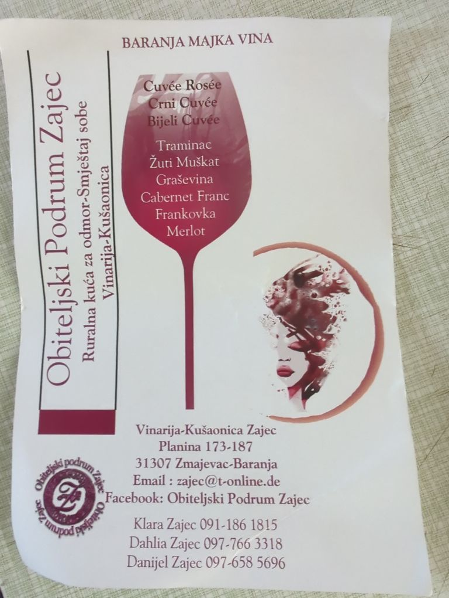
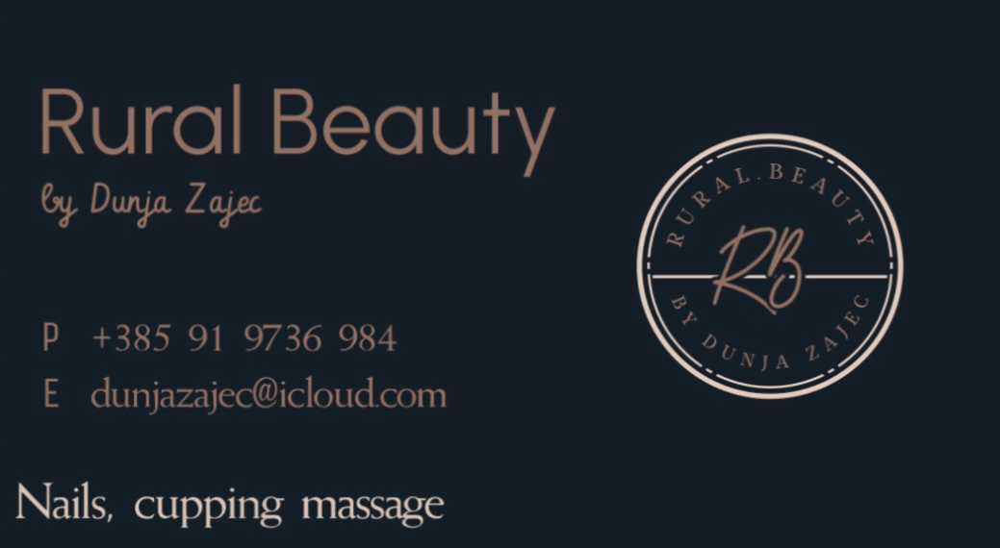
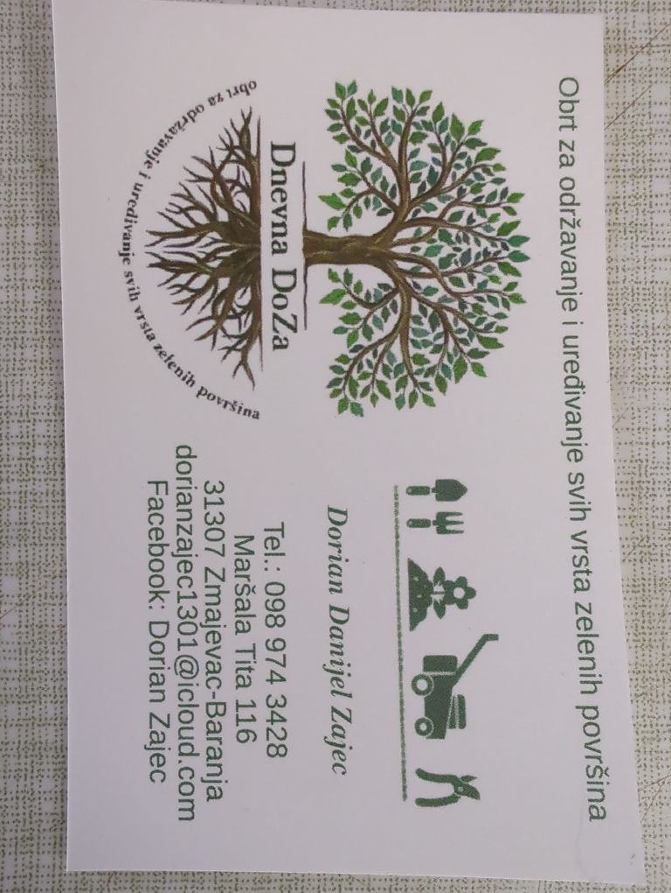

# Amenities

## Local Shop

Closest shop.  Open until 8pm but closed on Sundays.  https://www.openstreetmap.org/#map=19/45.79835/18.80408

## Local Food - Zmajevac

Organic, free range chicken (3€ per 10) and duck (10€ per 10) eggs, plus rabbit meat (hare) from a homestead in Zmajevac.
During the harvest season they also have marmalades, fruit syrups, home made cosmetics and tinctures.

BTC accepted.  Contact a Dragon for details.

### Local Food - Batina

A variety of goats Cheese, fresh eggs, yoghurt, chickens (whole, or cuts), goat meat, rabbit, and occasionally other items.  Call **Vince** for info (or message on Signal).  In Batina but can deliver if the order is big enough.

+385955293555

## Zajec Wine

These guys make excellent wine.  Just call and collect.  BTC accepted.

## Cup Massage and Nail Service

By a local professional. Shellac 20€, full set (extend nails) 30€.  The cupping massage is 35€.
Available Monday-Friday from 5pm to 9pm or Saturdays and Sundays from 8am to 1pm.  

Email Dunja:  dunjazajec@icloud.com

## Gardening

Contact Dorian on dorianzajec1301@icloud.com

## Taxi (to Pecs, Hungary)

We have the contact of a taxi driver in Pecs (Roland) who can arrange transport to / from Zmajevac for around 35-40k HUF (~100 EUR)

Contact a Dragon for details.

## Kovac Csarda

Our recommended restaurant, good prices and great service:  https://www.openstreetmap.org/#map=19/45.78944/18.78805

## Restaurant Josic

This is the closest restaurant, however we urge caution if you choose to visit, as they are known to inflate the size of the bill for tourists.

