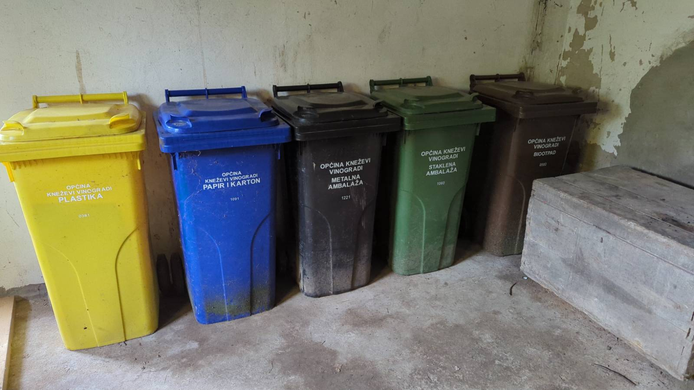
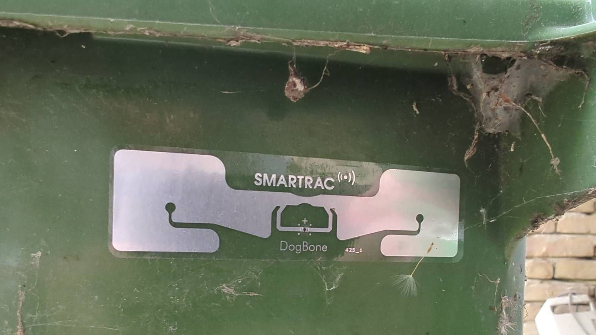

# Trash

Trash should be separted as follows:

* Paper / cardboard - BLUE 
* Plastics - YELLOW
* Metals - BLACK
* Glass - GREEN (Staklena)
* Mixed - GREEN (unmarked)

## Sorted Trash 

Sorted (marked) containers are collected alternate **Wednesdays** according to the schedule below (but sometimes are collected a day later).

Zmajevac is the section referenced as "Popovac I Kn. Vinogradi"

## Mixed Trash (Green)

Mixed (Green, unmarked) is collected every **Monday**.  Some people have a contract for 2 mondays a month, which is slightly cheaper, and might be worth moving to at some point.

Important - be sure to use the green bin with the sticker below!  This is the RFID chip, and they won't take the other one (without the sticker)

