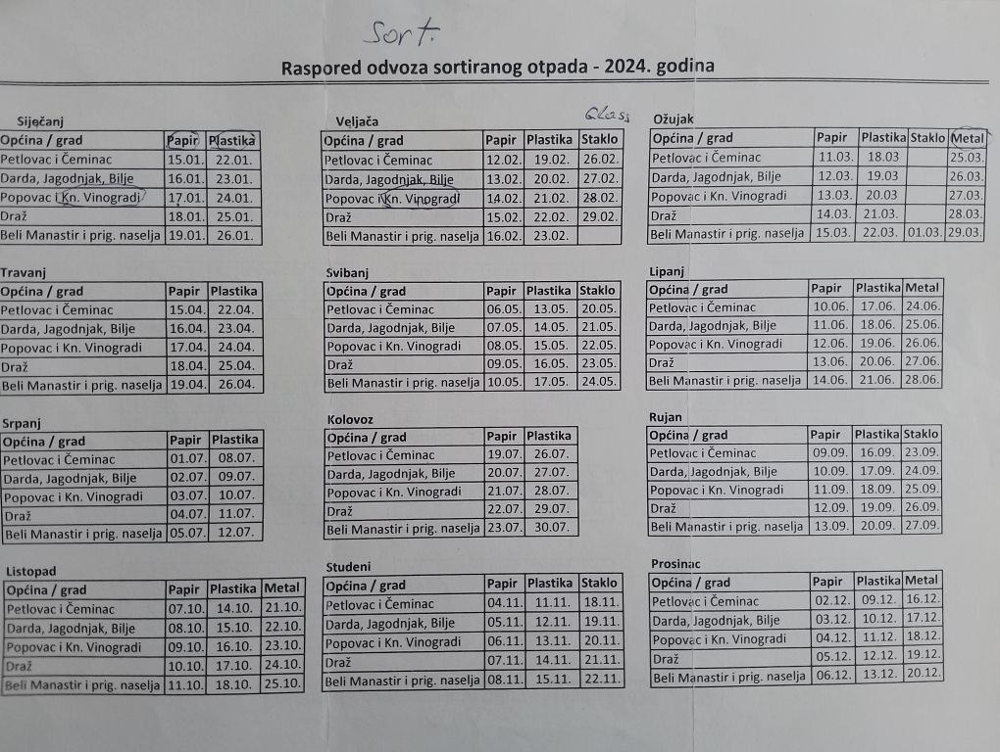
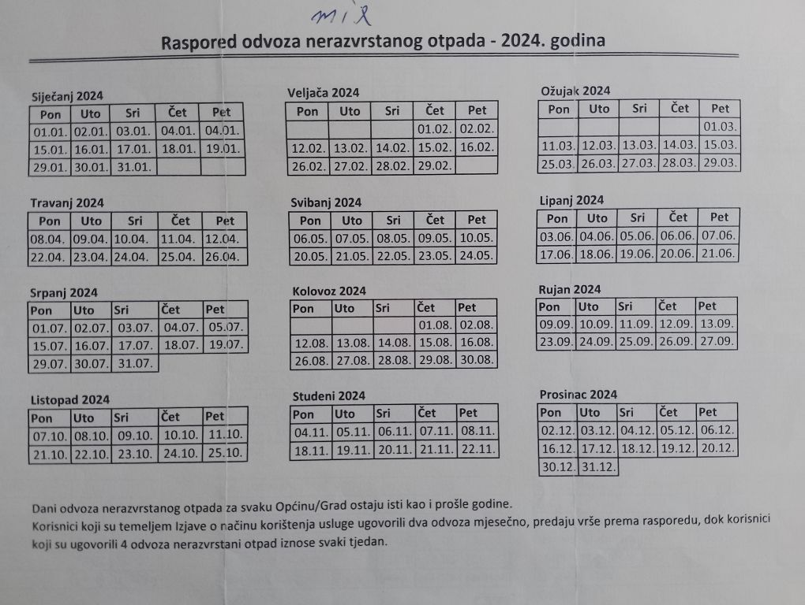

# Trash

Trash should be separted as follows:

* Paper / cardboard - YELLOW 
* Plastics - BLUE
* Metals - BLACK
* Mixed - GREEN

## Sorted Trash (Yellow / Blue)

Yellow / Blue / Black containers are collected alternate **Wednesdays** according to the schedule below.

## Mixed Trash (Green)

Mixed (Green) is collected every **Monday**.  Some people have a contract for 2 mondays a month, which is slightly cheaper, and might be worth moving to at some point.

